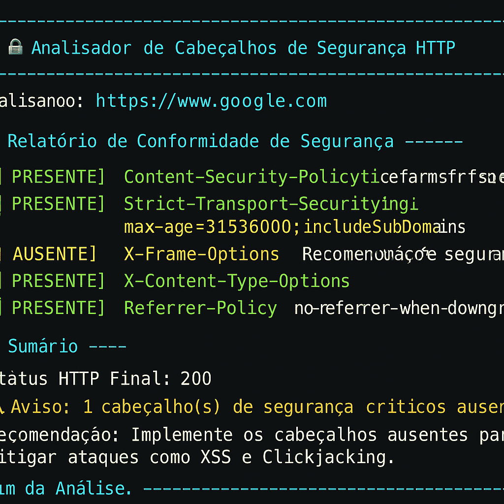

## 👨‍💻 Autor

<div align="center">
  
  <br>
  <strong>Onivaldo Miquelino</strong>
  <br>
  <a href="https://github.com/ninomiquelino">@ninomiquelino</a>
</div>

---

# 🔒 Ferramenta CLI PHP para Análise de Cabeçalhos de Segurança HTTP

Uma ferramenta de linha de comando (CLI) em **PHP** que analisa os principais **cabeçalhos de segurança HTTP** de um site e exibe um relatório colorido de conformidade.  
Ideal para **desenvolvedores**, **analistas de segurança** e **equipes DevSecOps** que desejam validar políticas como **CSP**, **HSTS** e **X-Frame-Options**.

---

## ⚙️ Funcionalidades

- ✅ Detecta automaticamente os principais cabeçalhos de segurança HTTP:
  - `Content-Security-Policy`
  - `Strict-Transport-Security`
  - `X-Frame-Options`
  - `X-Content-Type-Options`
  - `Referrer-Policy`
- 🧩 Mostra cabeçalhos presentes e ausentes com cores ANSI (verde/vermelho).
- 🚦 Segue redirecionamentos (útil para validar HSTS final).
- 🕒 Timeout configurável e tratamento de erros de rede.
- 🧠 Saída amigável e clara no terminal.

---

## 🧰 Tecnologias Utilizadas

- 🐘 **PHP 8.3+**
- 🌐 **cURL**
- 🎨 **ANSI Colors (Terminal Output)**

---

## 📦 Instalação

Clone o repositório e conceda permissão de execução:

```bash
git clone https://github.com/ninomiquelino/php-security-header-analyzer.git
cd php-security-header-analyzer
chmod +x security_header_analyzer.php
```
---

## 📦 Como usar

Execute o script informando a URL que deseja analisar:

php security_header_analyzer.php https://exemplo.com

---

## 🖥️ Demonstração Visual

Exemplo da execução no terminal 👇



---

## 🧩 Estrutura do Projeto
```
php-security-header-analyzer/
📁 docs/
│   └── demo-terminal-output.png
├── security_header_analyzer.php
├── README.md
├── .gitignore
└── LICENSE
```

---

## 📋 Requisitos

- ✅ PHP 7.4 ou superior
- ✅ Extensão cURL habilitada
- 🌐 Conexão com a Internet

---

## 🎓 Conceitos e Objetivo Educacional

Este projeto tem finalidade educacional e prática, demonstrando:

- 💡 Como utilizar PHP CLI para automação de testes de segurança.
- 🔒 Como realizar requisições HTTP seguras via cURL.
- 🧠 Como aplicar boas práticas DevSecOps no monitoramento de cabeçalhos de segurança.

---

## 🤝 Contribuições
Contribuições são sempre bem-vindas!  
Sinta-se à vontade para abrir uma [*issue*](https://github.com/NinoMiquelino/php-security-header-analyzer/issues) com sugestões ou enviar um [*pull request*](https://github.com/NinoMiquelino/php-security-header-analyzer/pulls) com melhorias.

---

## 💬 Contato
📧 [Entre em contato pelo LinkedIn](https://www.linkedin.com/in/onivaldomiquelino/)  
💻 Desenvolvido por **Onivaldo Miquelino**

---
